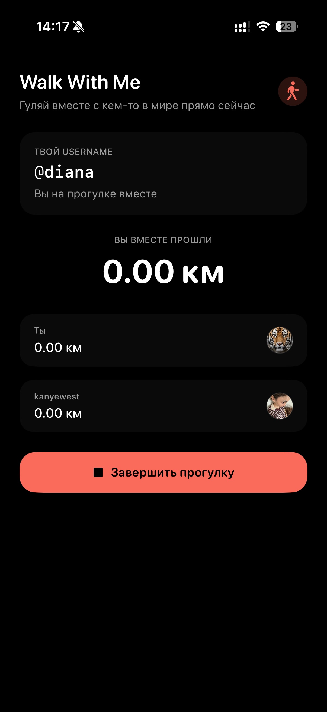
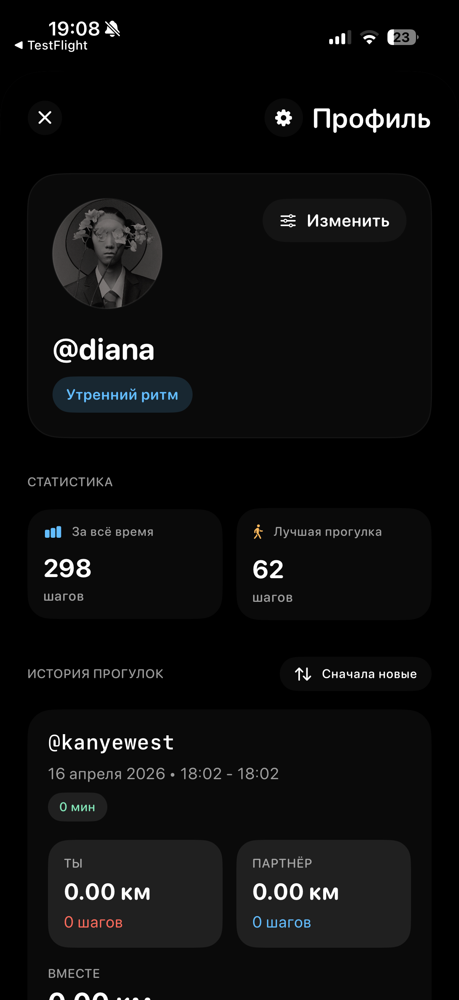

<p align="center">
  
</p>

<h1 align="center">Walk With Me</h1>

<p align="center">
  <strong>Ежедневные прогулки легче начать, когда кто-то гуляет с тобой — даже на расстоянии.</strong>
</p>

<p align="center">
  <a href="README.md">English</a>&nbsp;&nbsp;·&nbsp;&nbsp;<a href="README.ru.md">Русский</a>
</p>

<p align="center">
  
  
  
  
</p>

`Walk With Me` — iOS-приложение для совместных прогулок на расстоянии. Оно соединяет двух людей в одной сессии, синхронизирует шаги и дистанцию почти в реальном времени и сохраняет завершённые прогулки как общую историю.

<p align="center">
  
</p>

> Основной репозиторий приложения приватный. Здесь — продуктовый кейс, устройство системы и избранные экраны без ключей, пользовательских данных и деталей production-инфраструктуры.

## Идея

Одному выйти на прогулку легко отложить. Совместная прогулка создаёт мягкую договорённость: позвать человека, начать когда оба готовы, видеть его прогресс и сохранить результат как общий момент.

| Позвать друга | Найти случайного вокера | Сохранить историю |
| --- | --- | --- |
| Отправить внутреннее приглашение по username или выбрать недавнего вокера. | Подключиться анонимно, без превращения случайной прогулки в социальную связь. | Смотреть личную статистику, совместные прогулки, дистанцию и историю. |

## Как Выглядит Flow

<p align="center">
  
  
</p>

<p align="center"><sub>Позвать человека · дождаться подключения</sub></p>

<p align="center">
  
  
  
</p>

<p align="center"><sub>Гулять в реальном времени · видеть ритм человека · собирать общую историю</sub></p>

## Что Реализовано

- Friend-сессии: поиск по username, приглашение, принятие или отклонение и быстрый повторный инвайт недавнему вокеру.
- Анонимные random-сессии: без раскрытия личности и без записи в статистику «вы вместе».
- Живой прогресс: шаги из `CMPedometer` и расстояние из `Core Location`, синхронизированные через Supabase Realtime.
- Устойчивый lifecycle сессии: ожидание, активная прогулка, завершение, истечение приглашения и восстановление после возвращения приложения из фона.
- Профили: аватар, визуальный ритм прогулок, личная статистика, последнее посещение и общая статистика с конкретным вокером.
- Приватность: управление видимостью последней прогулки и города в random-режиме.
- Проработка продукта: локализация `ru` / `en`, empty states, feedback для инвайтов, итоговая карточка прогулки, кадрирование аватара и управление кэшем.

## Инженерная Часть

В этом продукте сложнее не интерфейс, а согласованность двух устройств: приложение может уйти в фон, перезапуститься или временно потерять сеть.

```text
CMPedometer / CLLocation
          ↓
WalkingViewModel (@MainActor)
          ↓  debounce + single-flight upload
Supabase Postgres ─── Realtime ─── обновление обоих устройств
          ↓
серверные правила восстанавливают публичный статус прогулки
```

- `walk_sessions` — серверный source of truth для состояния и прогресса сессии.
- Аплоады прогресса дебаунсятся и не выполняются параллельно, чтобы записи не конкурировали друг с другом.
- После возвращения в приложение локальные счётчики сверяются с серверным состоянием, а не запускаются заново.
- Database trigger вычисляет `profiles.is_walking_now` из активных сессий: один клиент не может навсегда оставить бейдж «Гуляет сейчас».
- Random-сессии явно помечены и исключаются из статистики отношений между пользователями.

Подробнее: [архитектура](architecture/overview.md).

## Стек

| Зона | Технологии |
| --- | --- |
| Приложение | Swift, SwiftUI, MVVM, Swift Concurrency, Combine |
| Realtime backend | Supabase Auth, Postgres, Realtime, Storage, Edge Functions |
| Шаги и геолокация | `CMPedometer`, `CLLocationManager`, `CLGeocoder` |
| Локальная производительность | `UserDefaults`, дисковый кэш истории, кэш аватаров |
| Качество и доставка | RLS-политики, TestFlight, расследование крэшей и release hardening |

## Структура Проекта

```text
Core/           тема, DI, локализация, форматирование, cache policy
Data/           Supabase-репозитории и платформенные сервисы
Domain/         модели профиля, сессий, инвайтов, истории и аналитики
Presentation/   SwiftUI-фичи, переиспользуемые views и view models
supabase/       схема, RLS-политики, triggers и backend setup
```

## Приватность

- В репозитории нет ключей, credentials, backend URL или пользовательских данных.
- Случайные прогулки остаются анонимными и не появляются в блоке «вы вместе».
- Пользователь сам управляет видимостью времени последней прогулки и города для random-режима.

## Статус

Приложение активно развивается и распространяется через TestFlight.

---

<p align="center"><sub>Независимый продуктовый кейс iOS-разработки.</sub></p>
